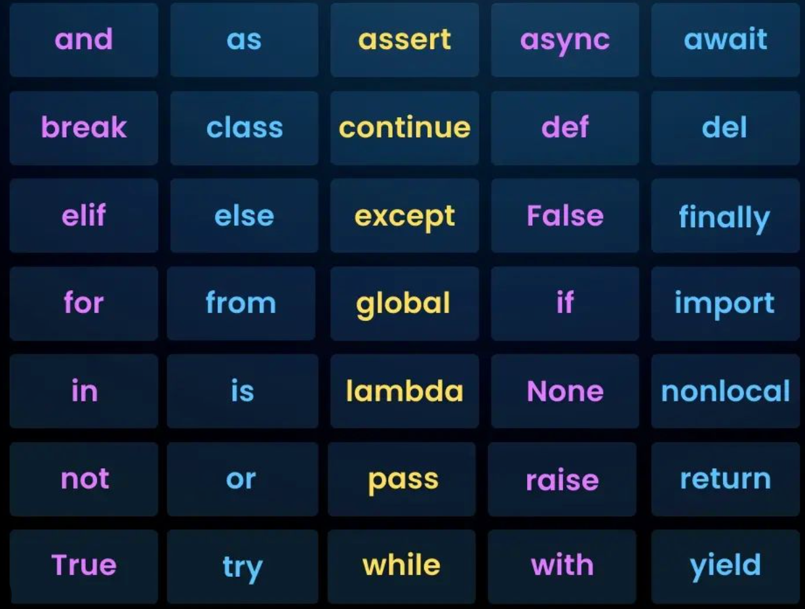

# Getting Started

## SQL Installation

### How to Install SSMS
[SSMS](https://learn.microsoft.com/en-us/ssms/install/install)

### How to Install PostgreSQL
[PostgreSQL](https://www.postgresql.org/download)

## SQL Introduction

### What is SQL?

#### SQL - Structured Query Language

*It is a standardized programming language used to:*

- Store Data
- Retrieve Data
- Manage Data
- Update Data
- Delete Data

*in relational databases*

### Uses of SQL

*Key Functions:*

- Data Definition
- Data Retrieval (Querying)
- Data Manipulation (CRUD)
- Data Control
- Data Analysis

### SQL commands
*Five Different Categories*
1. Data definition language (DDL): Define /changes the structure of database objects
- `CREATE, ALTER, DROP, TRUNCATE, RENAME`
2. Data Manipulation Language (DML): Works with the data inside tables
- `SELECT, INSERT, UPDATE, DELETE, MERGE`
3. Data Control Language (DCL): Controls access and permissions on data
- `GRANT, REVOKE`
4. Data Query Language (DQL): Retrieves data from database
- `SELECT`
5. Transaction Control Language (TCL): Manages transactions in a database
- `COMMIT, ROLLBACK, SET TRANSACTION`

### Why SQL is Important?
- Works with every major database (MySQL, SQL Server, PostgreSQL, Oracle)
- Essential skill for Data Science, Data Analytics, Software Dev, and Business Intelligence
- Most demanded skill in IT and finance jobs

## Setup Environment for Python

### How to Install Anaconda
[Anaconda](https://www.anaconda.com/download)

### Or start with Google Colab
[Google Colab](https://colab.research.google.com/)

## Introduction to python

### What is Python?
*Python is a interpreted, object-oriented, high-level, easy, and powerful programming language with dynamic semantics used for:*
- Automations
- Data Science
- Web Apps
- Al & Machine Learning
- Cybersecurity

*Write less, do more!*

### Tokens in Python
1. Identifiers
- *Names given to variables, functions, classes, etc.*
- Example: `name = "John"`

2. Keywords
- *Words reserved by Python with special meaning.*
- *There are 35+ keywords in Python.*
- Example: `if, else, class, True, False, return`

3. Literals
- Fixed values in a program:
    - 10 → Integer literal
    - 5.5 → Float literal
    - "Hello" → String literal
    - True → Boolean literal
4. Operators
- Symbols that perform operations.
- Types:
    - Arithmetic → `+ - * / % ** //`
    - Comparison → `== != > <>=<=`
    - Logical → and or not
    - Assignment → `= += -=`
    - Membership → `in, not in`
    - Identity → `is, is not`

5. Punctuators (Special Symbols)
*Used for structure/formatting.*
    - `[ ] { } ( ) : , . # @`

6. Comments
- Ignored by Python - used for explanation.
    - `# This is a comment`
 
 
 

✨ *Master SQL & Python one week at a time*  
💪 *Level up your skills week-by-week*

*𝗙𝗼𝗹𝗹𝗼𝘄 ╰┈➤ [`@brew_code zone`](https://www.instagram.com/brew_code_zone/) on* 🅾 𝐈𝐧𝐬𝐭𝐚𝐠𝐫𝐚𝐦 ★ *for daily Learnings*